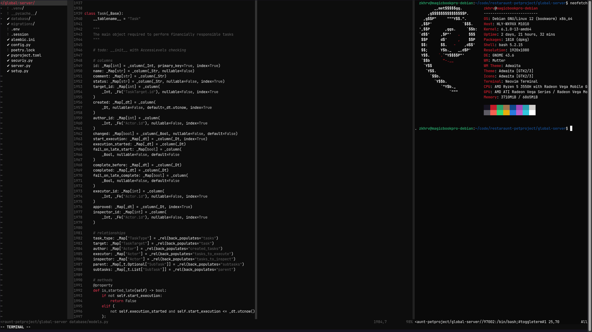
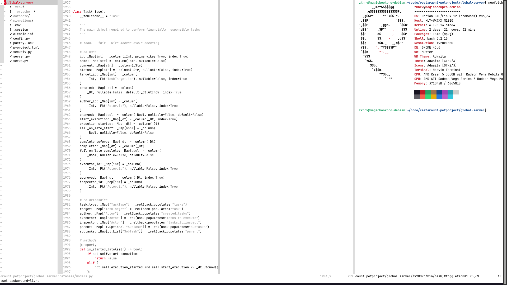

# About

Vim-Cherry is a simple, high-contrast theme with single accent color.


### Installation

```vim script
Plug ('Vchslv-Zkhrv/vim-cherry')
```


### Screenshots



Font: JetBrains Mono


### Features

- Hight-contrast, easy to read
- Light and dark versions
- Unchanged terminal colors
- Easy to modify


### Inspired by

- The main reference: [huyvohcmc/atlas.vim](https://github.com/huyvohcmc/atlas.vim)
- Very similar to: [stefanvanburen/rams.vim](https://github.com/stefanvanburen/rams.vim)
- Even more contrast: [t184256/vim-boring](https://github.com/t184256/vim-boring)
